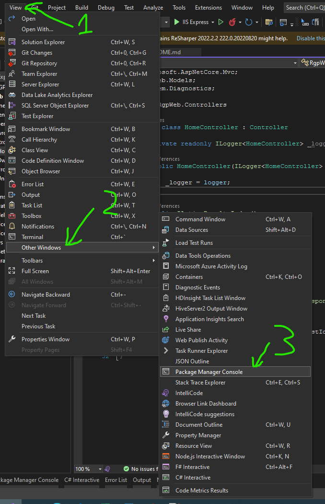
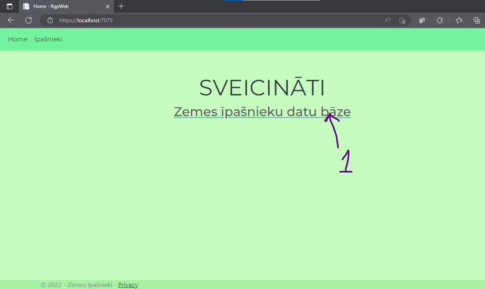
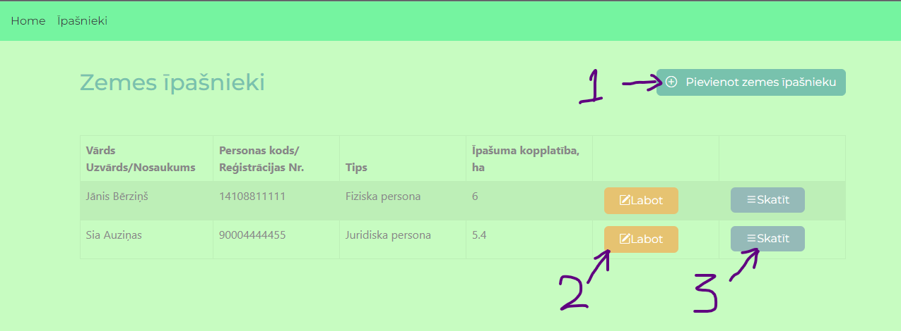
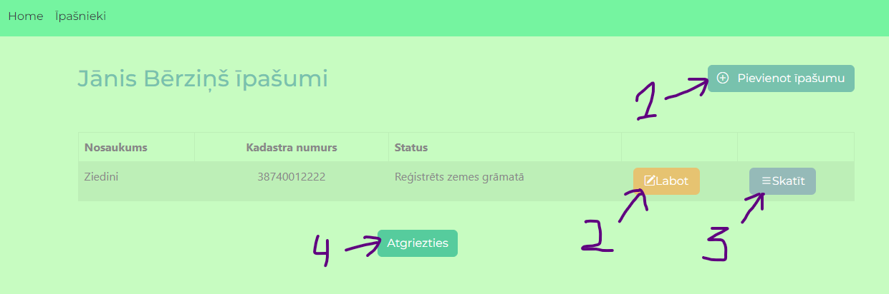
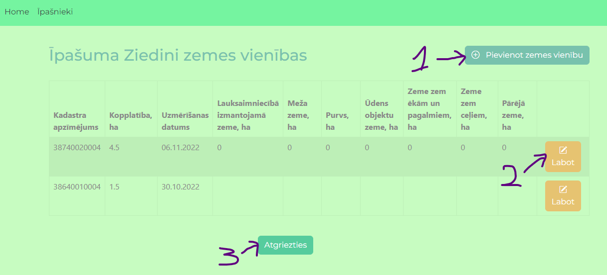
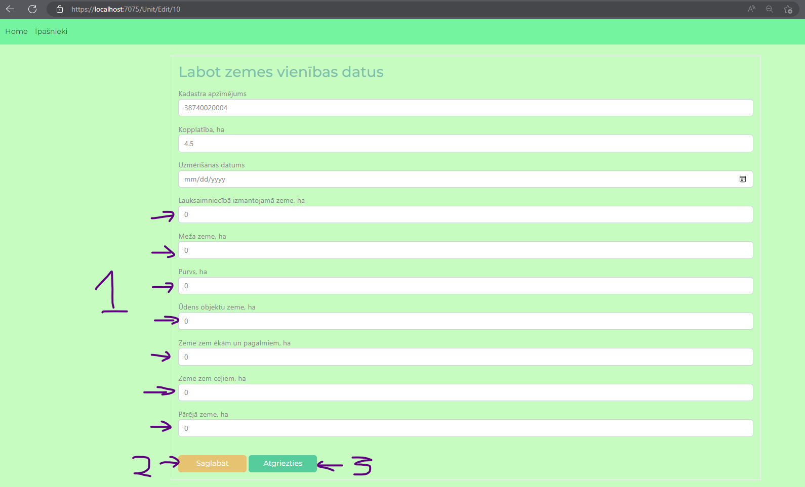

# Land Owner Database
## Description

This is technical task for company Sia "RGP". It is Web MVC project where can find:
* Land Owners part where can add new land owner or update land owner data
* Properties for each owner part where can add new propery to the selected land owner or update property data
* Land units for each property part where can add new land unit to the selected property or update property data and add land use types and area

Database has been created with Code First approach

## Install

* Clone this reposotory on your computer or download it as a .zip file and unarchive it;
* Open project in Visual Studio 2022 and ont the top left of the taskbar select View > Other Window > Package manager Console:

* Inside console write `update-database`;
* Start the project :)

## Usage

* Home page => 1. Go to land owner database

* Owner view page => 1. Add new land owner; 2. Edit seleted land owner data; 3. Go to selected owner property view

* Property view page => 1. Add new property to the selected owner; 2. Edit selected property data; 3. Go to selected property land unit view; 4. Return to land owner view

* Unit view page => 1.Add new land unit to the selected property; 2. Edit selected land unit data and add unit land use type area; 3. Return to property view

* In the unit edit view can update unit data and add unit land use type areas(1); 2. Confirm update 3. Return to unit view

## Technologies used

* ASP.NET Core Web MVC;
* Entity Framework (core, SQLServer, tools)

## Further updates

If I had more time for this project, I would:
* Add search for incomplete data - owners without properies, properties without units, units without land use type areas
* Made a summary of all objects
* Work on page view design

